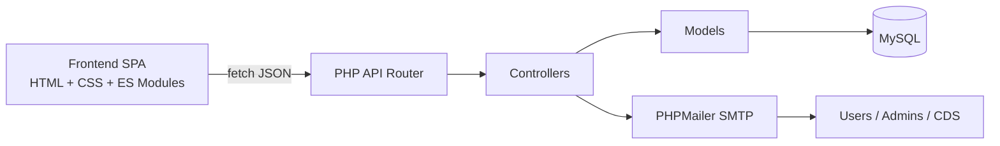
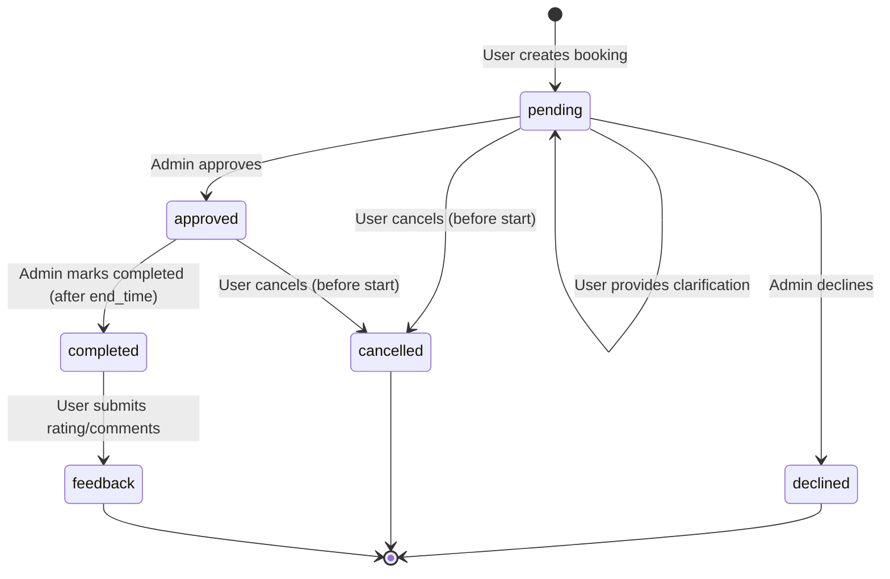

# ROOK

<div align="center">
	<h3>Advanced Room Booking Intelligence Platform</h3>
	<p>
		CAS-secured authentication • role-aware approvals • live availability engine • analytics + calendar command center
	</p>

	<p>
		
		
		
		
		
	</p>
</div>

## 1. What ROOK Delivers

ROOK is a full-stack room booking portal built for institutional usage, with a modern glassmorphism UI and a PHP/MySQL backend designed around real scheduling constraints.

It supports:

- CAS login and session-backed authentication
- conflict-safe booking requests with room capacity checks
- admin approval workflow with decline and clarification loop
- participant (guest) tagging per booking
- refreshments workflow (including CDS email trigger)
- notification center with unread tracking and action navigation
- user feedback collection for completed bookings
- admin analytics, charting, and PDF export for today’s schedule
- dual calendar experiences:
	- personal/all-bookings calendar
	- room-centric weekly occupancy calendar

## 2. Signature Features

### User Experience

- futuristic landing + CAS entry flow
- book-room flow with live availability search and room cards
- filtered personal schedule (list + calendar toggle)
- cancellation and completion confirmations via modal UX
- feedback modal with interactive star rating

### Admin Experience

- pending queue with Approve, Decline, and Request More Info actions
- clarification round-trip with user responses
- analytics dashboard with month/year/room filters
- user feedback board with room filter and pagination
- one-click export of today’s approved schedule as PDF

### System Intelligence

- overlap conflict detection on pending/approved bookings
- role-aware data visibility (`own` vs `all` bookings)
- trend-ranked room discovery (WTRS ranking in search module)
- periodic notification polling and unread badge updates

## 3. Architecture Overview



### Request Flow

1. Browser calls API under `/src/backend/public`.
2. Router dispatches to route groups (`auth`, `rooms`, `bookings`, `feedback`, `users`, `notifications`).
3. Controllers validate input and enforce role/session rules.
4. Models execute SQL via PDO and return structured data.
5. API responds with a unified response envelope:

```json
{
	"success": true,
	"message": "...",
	"data": { }
}
```

## 4. Booking Lifecycle



## 5. Project Structure

```text
Room_booking_Portal/
├─ src/
│  ├─ frontend/               # SPA UI, modules, styles
│  ├─ backend/
│  │  ├─ controllers/         # business logic
│  │  ├─ models/              # data access
│  │  ├─ routes/              # endpoint mapping
│  │  ├─ middleware/          # auth/admin guards
│  │  ├─ database/            # connection, schema, seeder
│  │  ├─ utils/               # response + email helpers
│  │  └─ public/index.php     # API entry
│  ├─ index.php               # redirects to frontend
│  └─ router.php              # PHP built-in server router
└─ README.md
```

## 6. API Quick Reference

Base URL during local run:

- `http://localhost:8000/src/backend/public`

### Health and Auth

| Method | Endpoint | Auth | Description |
|---|---|---|---|
| GET | `/health` | No | API + DB health check |
| GET | `/login` | No | Redirect to CAS login |
| GET | `/callback?ticket=...` | No | CAS callback validation |
| GET/POST | `/logout` | Yes | Session clear + CAS logout redirect |
| GET | `/me` | Yes | Current logged-in user |

### Rooms

| Method | Endpoint | Auth | Description |
|---|---|---|---|
| GET | `/rooms` | No | List rooms (optional `type`, `capacity`) |
| GET | `/rooms/available` | No | Available rooms for slot (`startTime`, `endTime`, filters) |
| GET | `/rooms/{id}` | No | Room details |
| GET | `/rooms/{id}/availability` | No | Availability check for one room |
| GET | `/rooms/{id}/feedback` | Yes | Feedback for room |
| GET | `/rooms/{id}/bookings` | Yes | Booking schedule for room |

### Bookings

| Method | Endpoint | Auth | Role | Description |
|---|---|---|---|---|
| POST | `/bookings` | Yes | User/Admin | Create booking request |
| GET | `/bookings` | Yes | User/Admin | Filter bookings (`userId` only effective for admin) |
| GET | `/bookings/{id}` | Yes | User/Admin | Booking by id |
| PATCH | `/bookings/{id}` | Yes | Owner | Update booking |
| PATCH | `/bookings/{id}/cancel` | Yes | Owner | Cancel own booking |
| PATCH | `/bookings/{id}/complete` | Yes | Admin | Mark approved booking as completed |
| PATCH | `/bookings/{id}/approve` | Yes | Admin | Approve pending booking |
| PATCH | `/bookings/{id}/decline` | Yes | Admin | Decline with reason |
| PATCH | `/bookings/{id}/request-details` | Yes | Admin | Ask user for clarification |
| POST | `/bookings/{id}/provide-details` | Yes | User/Admin | Submit clarification response |
| GET | `/bookings/statistics` | Yes | Admin | Aggregated stats |

### Feedback, Users, Notifications

| Method | Endpoint | Auth | Role | Description |
|---|---|---|---|---|
| POST | `/feedback` | Yes | Owner | Submit feedback (completed booking only) |
| GET | `/feedback` | Yes | Admin | Get all feedback or by `bookingId` |
| GET | `/users` | Yes | User/Admin | Get users list (for participant selection) |
| GET | `/notifications` | Yes | User/Admin | My notifications |
| PATCH | `/notifications/mark-all-read` | Yes | User/Admin | Mark all as read |
| PATCH | `/notifications/{id}/read` | Yes | User/Admin | Mark one as read |
| DELETE | `/notifications/{id}` | Yes | User/Admin | Delete one notification |

## 7. Local Setup

## 7.1 Prerequisites

- PHP 8.1+
- MySQL 8+ (or compatible MariaDB)
- A browser with JS enabled
- CAS account access (for real login flow)

## 7.2 Clone and Enter

```bash
git clone <your-repository-url>
cd Room_booking_Portal
```

## 7.3 Create Database

```sql
CREATE DATABASE rbp_prototype CHARACTER SET utf8mb4 COLLATE utf8mb4_unicode_ci;
```

Import schema:

```bash
mysql -u root -p rbp_prototype < src/backend/database/schema.sql
```

## 7.4 Configure DB Connection

Edit:

- `src/backend/database/connection.php`

Set:

- `$host`
- `$dbname`
- `$user`
- `$password`

## 7.5 Configure Email (Optional but Recommended)

Edit:

- `src/backend/config/mail.php`

Set your SMTP values and app password. Email features include:

- booking request mail to admins
- approval mail to requester
- decline mail to requester
- refreshment request mail to CDS

## 7.6 Seed Sample Data (Optional)

```bash
php src/backend/database/seeder.php
```

## 7.7 Start the App

From project root:

```bash
php -S localhost:8000 -t . src/router.php
```

Open:

- `http://localhost:8000/`

Health check:

- `http://localhost:8000/src/backend/public/health`

## 8. Frontend Libraries Used

- Chart.js (dashboard analytics)
- FullCalendar (schedule + room calendar)
- jsPDF + autotable (admin PDF export)
- Font Awesome (icons)

All are loaded via CDN in `src/frontend/index.html`.

## 9. Business Rules Enforced in Code

- Room type validation: `classroom` or `meeting`
- Capacity must be positive and not exceed room capacity
- End time must be after start time
- Overlap conflict prevention for pending/approved bookings
- Only owner can cancel/update own booking
- Only admin can approve/decline/request-details/complete
- Feedback allowed only once and only after booking is completed

## 10. Security and Production Hardening Notes

Before production deployment:

- move DB and SMTP secrets to environment variables
- remove hardcoded credentials from tracked files
- enable HTTPS and secure session cookie settings
- add CSRF protections for state-changing endpoints
- add rate limiting and centralized audit logging
- consider replacing polling notifications with WebSocket/SSE

## 11. Known Implementation Notes

- Search and booking forms currently show extra room type options (`conference`, `lab`) while backend accepts `classroom` and `meeting`.
- Seeder has a notifications section that intends to attach notifications to bookings; review booking-id collection logic if richer sample notifications are needed.

## 12. Why This Project Stands Out

ROOK is not just CRUD around rooms. It combines:

- institutional SSO (CAS)
- real scheduling constraints and conflict logic
- role-sensitive operations and visibility
- operational email workflows
- notification-driven interaction loops
- admin analytics and export tooling
- modern, premium-feel interface architecture

That combination makes it a strong portfolio-grade system and a practical base for campus or enterprise booking operations.
